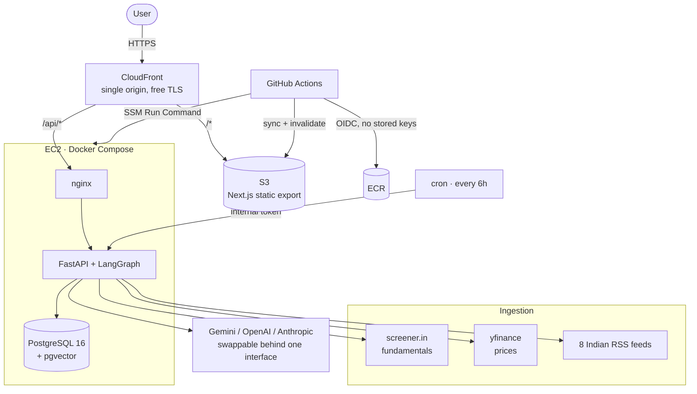

# Sentellent — Contextual Agentic AI Indian Equity Analyst

An equity-research chief of staff for the NSE and BSE. Follow Indian tickers, and
the system ingests their fundamentals and recent Indian financial news into a
vector store, learns your investor persona from conversation, and answers
questions with **grounded, cited analysis in INR**.

If a claim isn't supported by an ingested source, the agent says so instead of
inventing a number.

> Built for the Sentellent Full Stack AI SDE Internship challenge.

**Live application:** _(URL added after deploy)_

---

## Contents

- [What it does](#what-it-does)
- [Architecture](#architecture)
- [How grounding is enforced](#how-grounding-is-enforced)
- [Engineering at scale](#engineering-at-scale)
- [Running locally](#running-locally)
- [Deploying to AWS](#deploying-to-aws)
- [CI/CD](#cicd)
- [Cost and teardown](#cost-and-teardown)
- [Requirement checklist](#requirement-checklist)

---

## What it does

1. **Sign in with Google.** Server-side OAuth 2.0; the session is an httpOnly
   JWT cookie. The browser never handles a token.
2. **Follow a ticker.** `RELIANCE`, `TCS`, `HDFCBANK`. Following triggers an
   ingestion run: fundamentals from screener.in, one year of prices via
   yfinance (`.NS`), and recent articles from eight Indian financial RSS feeds.
3. **Ingestion indexes it.** Articles are canonicalised, deduplicated, chunked,
   embedded and written to pgvector. An LLM pass tags each article's per-stock
   sentiment, materiality and event type; a rolling time-decayed sentiment score
   is recomputed in SQL.
4. **Chat.** Ask *"What's the sentiment on TCS this week?"* and the agent
   retrieves, then answers with `[1]`-style citations that link back to the
   exact article or fundamentals row.
5. **It learns you.** Say *"I'm conservative, dividend-focused, and I avoid
   high-debt companies"* and that becomes durable memory — stored as facts, as
   factor weights, and as a machine-readable screening rule.
6. **Personalised screening.** *"What should I buy for my profile?"* ranks your
   followed stocks against your persona and drops the ones your own rules
   exclude, saying which rule and why.

---

## Architecture



Serving the SPA and the API through **one** CloudFront distribution means the
app is same-origin: the session cookie is first-party, there is no CORS surface,
and Google OAuth gets the HTTPS redirect URI it requires — without buying a
domain or a certificate.

### The agent

A LangGraph state machine, not a single prompt:

```
understand ──► retrieve ──┬──► rank ──► answer
                          └──────────► answer
```

| Node | Responsibility |
|---|---|
| `understand` | Writes persona memory from this turn, resolves which tickers the question is about, classifies intent |
| `retrieve` | Hybrid search — vector + keyword, fused by reciprocal rank |
| `rank` | Recommendation questions only. Pure arithmetic, no model call |
| `answer` | The only node that generates prose, and only when sources exist |

### Retrieval

Vector search alone is weak on the things Indian equity questions turn on —
exact tickers, rupee figures, quarter labels. Keyword search alone misses
paraphrase. Both run and are fused with reciprocal rank fusion, which needs no
score normalisation between two incomparable scales.

Search is scoped to the stocks a user follows, so result sets stay small and
relevant as the corpus grows.

---

## How grounding is enforced

Grounding is **structural**, not a polite request in a prompt:

- **No sources ⇒ no model call.** If retrieval returns nothing, `answer`
  short-circuits to an honest "I don't have that in the data I've ingested"
  and never reaches the LLM. It cannot hallucinate a response it was never
  asked to write.
- **Numbered sources are the contract.** Retrieved chunks are rendered as
  `[1] … [2] …`, and the same numbers return to the UI as clickable links.
- **Unmatched citations don't render.** The frontend only linkifies a `[n]`
  marker if source `n` actually exists in the response.
- **Distinguished failure modes.** "You haven't followed anything yet" and
  "I have this ticker but nothing that answers your question" are different
  messages, because they need different actions from the user.
- **INR throughout.** Formatting lives in one place on each side, and the
  fundamentals text passed to the model spells out units (`Rs. 1,234.50`,
  `Rs. 4.2 lakh crore`) rather than emitting bare numbers.

---

## Engineering at scale

The brief asks for efficient engineering rather than brute-force LLM calls.
Concretely:

### Cost

| Technique | Effect |
|---|---|
| Content-addressed embedding cache, keyed by `(sha256(text), model)` | A story syndicated across Moneycontrol, ET and Mint is embedded **once, ever** — across every stock and every user |
| Fundamentals content hash | Unchanged numbers are never re-embedded on a refresh |
| Batched sentiment tagging | **One** LLM call per ~12 articles, not one per article |
| Deterministic scoring | Ranking N stocks against a persona costs **zero** model calls |
| Regex intent routing | No model round-trip to tell "recommend something" from "tell me about TCS" |
| Rolling sentiment as a SQL aggregate | Time-decayed, impact-weighted, exact, and free |

### Deduplication

Two layers, because they catch different things:

1. **Exact** — `sha256(normalised_title + canonical_url)` with a `UNIQUE`
   constraint. Catches the same article re-appearing across feed polls. URL
   canonicalisation strips tracking parameters; title normalisation strips
   outlet suffixes and possessives.
2. **Semantic** — the same wire story republished by another outlet has a
   different title *and* URL, so hashing cannot catch it. Lead paragraphs are
   compared by cosine distance against a 3-day window; a near-duplicate is
   linked to the original rather than re-indexed.

### Idempotency and concurrency

Running ingestion twice changes nothing. Two jobs racing on the same ticker
cannot corrupt state:

- `pg_try_advisory_lock` per ticker — a concurrent second run returns
  `skipped` immediately rather than competing.
- Every write is an upsert. Article insertion is `ON CONFLICT DO NOTHING`, and
  the loser of a race reads the winner's row instead of failing.
- A `UNIQUE` index on `(kind, content_hash, article_id, stock_id)` makes
  double-indexing a chunk impossible at the database level.
- Migrations run inside an advisory lock, so parallel boots are safe.
- Every run is recorded in `ingest_runs` with per-stage counters.

### Safety

The persona extractor turns free text into screening rules, so its output is
treated as untrusted: rules are validated against an allow-list of fields and
operators and must carry a numeric threshold. Anything else is dropped, not
half-applied. A rule referencing missing data does **not** exclude a stock — a
data gap is a data gap, not grounds to hide a name from the user.

---

## Running locally

Works with **no API keys at all** — the LLM and embedding layers have offline
deterministic fallbacks, so ingestion, retrieval and chat all run end to end.

```bash
cp backend/.env.example backend/.env
docker compose up --build          # API on :8000, Postgres on :5432

cd frontend && npm install && npm run dev   # UI on :3000
```

Then `POST /api/auth/dev-login` (or use the Swagger UI at
`http://localhost:8000/api/docs`) to get a session without Google.

For real answers, set in `backend/.env`:

```bash
LLM_PROVIDER=gemini
EMBEDDING_PROVIDER=gemini
GOOGLE_API_KEY=AIza...     # https://aistudio.google.com/apikey
```

### Tests

```bash
cd backend
pip install -r requirements-dev.txt
pytest tests -v          # 34 tests, no database or network needed
ruff check app tests
```

The suite pins the parts that must not silently drift: factor scoring bands,
hard-rule screening (including that unknown fields are ignored and missing data
never excludes), the bounded influence of sentiment, chunking termination, and
article-hash idempotency.

---

## Deploying to AWS

**Prerequisites:** an AWS account with a payment method, Terraform ≥ 1.6, the
AWS CLI configured, and a Google OAuth client.

```bash
cd infra
cp terraform.tfvars.example terraform.tfvars   # fill in — gitignored
terraform init
terraform apply
```

Roughly 10 minutes, mostly CloudFront propagation. Then:

1. **Add the redirect URI to Google.** `terraform output oauth_redirect_uri`
   gives the exact string. Paste it into Google Cloud Console → Credentials →
   your OAuth client → Authorised redirect URIs. Login fails with
   `redirect_uri_mismatch` until this is done.
2. **Add the test users.** Google Cloud Console → OAuth consent screen → Test
   users → add `harisankar@sentellent.com` and `naga@sentellent.com`.
3. **Set the GitHub secrets.** `terraform output github_secrets_to_set` prints
   all six.
4. **Confirm the billing alarm.** AWS emails a subscription confirmation link.
5. **Push to `main`** — CI/CD takes it from there.

Shell access without SSH or a key pair:

```bash
aws ssm start-session --target $(terraform output -raw instance_id)
```

---

## CI/CD

Two workflows.

**`ci.yml`** — every push and PR: ruff lint and format check, pytest, frontend
typecheck and build, an assertion that the static export actually produced the
files the S3 deploy expects, plus a Docker build that boots the image and
curls its health endpoint.

**`deploy.yml`** — push to `main`, gated on CI passing:

1. Assume an AWS role via **GitHub OIDC** — no AWS access keys are stored in
   the repository or its settings.
2. Build and push the image to ECR, tagged both `sha-<commit>` (immutable, so
   any deploy can be traced and rolled back) and `latest`.
3. Roll out via **SSM Run Command** — the instance pulls the new image itself.
   No bastion, no open port 22, no SSH key in GitHub secrets.
4. Build the frontend, sync to S3 with split cache headers (immutable for
   hashed assets, no-cache for HTML), and invalidate CloudFront.
5. **Verify against the live URL** — the run is only green if the public site
   actually serves both the API and the app.

The IAM role is scoped to this repository via the OIDC `sub` claim, and to the
specific ECR repository, S3 bucket, CloudFront distribution and EC2 instance.

---

## Cost and teardown

Deliberately built to be cheap. Notable choices:

- **No NAT Gateway** (~$32/mo) — the instance sits in a public subnet with an
  Elastic IP and egresses through the free Internet Gateway. Inbound is closed
  to everything except CloudFront's managed prefix list.
- **No Application Load Balancer** (~$16/mo) — CloudFront is the entry point.
- **SSM Parameter Store**, not Secrets Manager — same capability here, free
  instead of $0.40 per secret per month.
- **CloudFront `PriceClass_100`** and a `t3.micro` with a 2 GiB swap file.

Roughly **$8–10/month**, and a billing alarm emails you if estimated spend
crosses a threshold you set.

```bash
cd infra && terraform destroy    # removes everything
```

---

## Requirement checklist

| Requirement | Where |
|---|---|
| OAuth login | `backend/app/auth.py` |
| Sentellent reviewers added as Google test users | Consent screen, see deploy step 2 |
| Follow NSE/BSE ticker → fetch, chunk, embed, index | `backend/app/ingest.py` |
| Fundamentals source (screener.in), NSE & BSE IDs stored | `backend/app/sources.py`, `stocks` table |
| Indian news RSS | 8 feeds in `backend/app/sources.py` |
| Prices via yfinance `.NS` | `backend/app/sources.py` |
| Embeddings + vector store, pipeline built by hand | pgvector + HNSW, `migrations/001_init.sql` |
| LLM tags sentiment / impact / event / stocks mentioned | `tag_untagged_articles` |
| Memory from chat | `backend/app/persona.py` |
| Memory from data (auto rolling sentiment) | `recompute_stock_sentiment` |
| Grounded, cited answers in INR | `backend/app/agent.py`, `retrieval.build_context` |
| Anti-hallucination | Structural — see [How grounding is enforced](#how-grounding-is-enforced) |
| Persona vector + factor scoring | `user_persona.embedding`, `score_stock` |
| Efficient retrieval and ranking | [Engineering at scale](#engineering-at-scale) |
| Idempotent, race-safe ingestion | Advisory locks + upserts + unique constraints |
| Dockerised | `backend/Dockerfile`, `docker-compose.yml` |
| Terraform provisions everything incl. vector store | `infra/` |
| CI/CD deploys on push to main | `.github/workflows/` |
| Scheduled refresh | cron → `/api/internal/refresh` |
| React/Next.js frontend | `frontend/` |
| LangGraph | `backend/app/agent.py` |

---

## Repository layout

```
backend/     FastAPI + LangGraph. app/ is the application, migrations/ is SQL.
frontend/    Next.js App Router, static export.
infra/       Terraform: VPC, EC2, S3, CloudFront, ECR, IAM/OIDC, alarms.
.github/     CI and deployment workflows.
```
